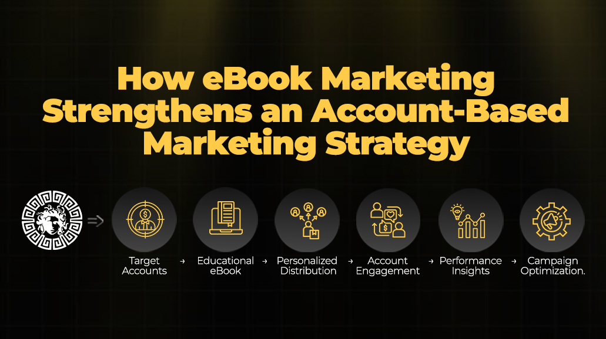
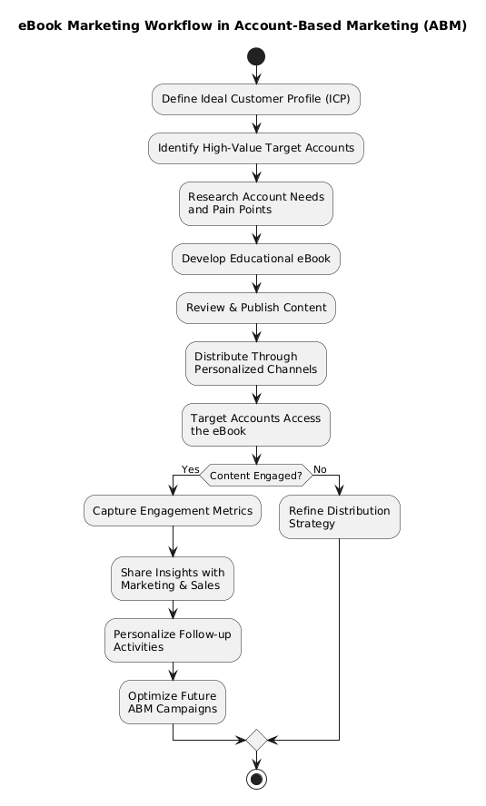

# How eBook Marketing Strengthens an Account-Based Marketing Strategy

Account-Based Marketing (ABM) focuses on engaging high-value accounts through personalized experiences rather than broad marketing campaigns. As organizations continue refining their B2B marketing efforts, educational content has become one of the most effective ways to support account engagement throughout the buying journey.

Among various content formats, eBooks provide an opportunity to deliver in-depth knowledge, address complex challenges, and establish credibility with decision-makers. When integrated into an [**b2b account based marketing**](https://vereigenmedia.com/account-based-marketing/) strategy, eBooks can support account education, improve engagement, and contribute to more informed buying decisions.

---

---

## Understanding Account-Based Marketing

**Account-Based Marketing (ABM)** is a strategic approach where marketing and sales teams collaborate to identify, prioritize, and engage a defined list of high-value accounts. Rather than targeting a broad audience, ABM emphasizes personalized communication tailored to the needs of individual organizations and stakeholders.

Modern **B2B account based marketing** strategies often combine audience insights, content personalization, first-party data, and multi-channel engagement to deliver relevant experiences across the customer journey.

---

## Why Educational Content Matters in ABM

Decision-makers typically evaluate multiple solutions before making purchasing decisions. Educational resources help organizations answer important questions during this evaluation process while building trust through valuable information.

Educational content within an ABM strategy can:

- Explain complex industry topics
- Support research-driven buyers
- Demonstrate subject matter expertise
- Address common business challenges
- Encourage meaningful engagement
- Enable informed decision-making

Rather than promoting products directly, educational resources help establish credibility throughout the buying process.

---

## The Role of eBooks in Account-Based Marketing

An eBook offers a structured format for presenting detailed information that cannot always be covered in shorter content formats.

Within an **account based marketing** program, eBooks may support:

- Awareness campaigns
- Account education
- Industry research distribution
- Solution comparisons
- Executive learning
- Decision support

Because eBooks provide substantial educational value, they often become foundational assets within personalized marketing initiatives.

---

## Supporting Personalized Buyer Experiences

One of the defining characteristics of successful ABM is personalization.

Different stakeholders within a target account often have unique responsibilities, priorities, and concerns. Educational resources can be aligned with these varying information needs to create more relevant experiences throughout the buying journey.

Organizations implementing **account based marketing services** frequently use educational content to support different stages of account engagement without relying solely on promotional messaging.

---

## eBooks Across the Buying Journey

Educational content can contribute throughout multiple stages of the decision-making process.

| Buying Stage | Role of eBooks |
|--------------|----------------|
| Awareness | Introduce industry concepts and challenges |
| Consideration | Explore approaches and best practices |
| Evaluation | Support solution research and comparison |
| Decision | Provide deeper educational insights |

This structured approach helps maintain consistent communication while delivering meaningful value to prospective accounts.

---

---

## Improving Sales and Marketing Alignment

One of the core principles of **B2B account based marketing services** is strong collaboration between sales and marketing teams.

Educational assets such as eBooks provide both teams with consistent messaging that can be used throughout account engagement.

Shared educational resources help:

- Maintain message consistency
- Improve account conversations
- Support personalized outreach
- Enable informed follow-up discussions
- Create a unified customer experience

This alignment contributes to more coordinated engagement efforts across target accounts.

---

## Measuring Content Engagement

Publishing educational content is only one part of an effective ABM strategy. Organizations also benefit from understanding how target accounts interact with that content.

Important engagement indicators may include:

- Content downloads
- Reading completion
- Repeat engagement
- Time spent with content
- Topic preferences
- Account-level participation

These insights can help marketing and sales teams better understand account interests while refining future campaigns.

---

## Selecting an Effective ABM Approach

Organizations evaluating an **account based marketing agency**, **account based marketing company**, or **B2B account based marketing agency** often consider several factors beyond campaign execution.

Common evaluation areas include:

- Personalization capabilities
- Audience targeting methodology
- Content strategy
- Engagement measurement
- Reporting transparency
- Sales and marketing collaboration
- Campaign optimization processes

A well-defined content strategy remains an important component of successful ABM initiatives.

---

## Best Practices for Integrating eBooks into ABM

Organizations can strengthen their account-based marketing efforts by following several best practices:

- Develop content for specific account needs.
- Focus on educational value before promotion.
- Align content with different buying stages.
- Measure engagement to improve future campaigns.
- Update educational resources regularly.
- Maintain consistency across marketing channels.

These practices help ensure that educational content remains relevant and valuable throughout long sales cycles.

---

## Conclusion

Educational content continues to play an important role in helping organizations build stronger relationships with target accounts. Among various content formats, eBooks provide a structured way to communicate detailed insights, support research-driven buyers, and encourage meaningful engagement throughout the buying journey.

When integrated into a broader [**b2b account based marketing strategy**](https://vereigenmedia.com/how-your-ebook-marketing-strategy-enhances-your-abm-content-strategy/), eBooks can enhance personalization, strengthen collaboration between sales and marketing teams, and contribute to more informed account engagement. As **B2B account based marketing** continues to evolve, organizations that prioritize educational content are better positioned to support long-term customer relationships.

For additional insights into how eBook marketing complements modern ABM strategies, read:
https://vereigenmedia.com/how-your-ebook-marketing-strategy-enhances-your-abm-content-strategy/
